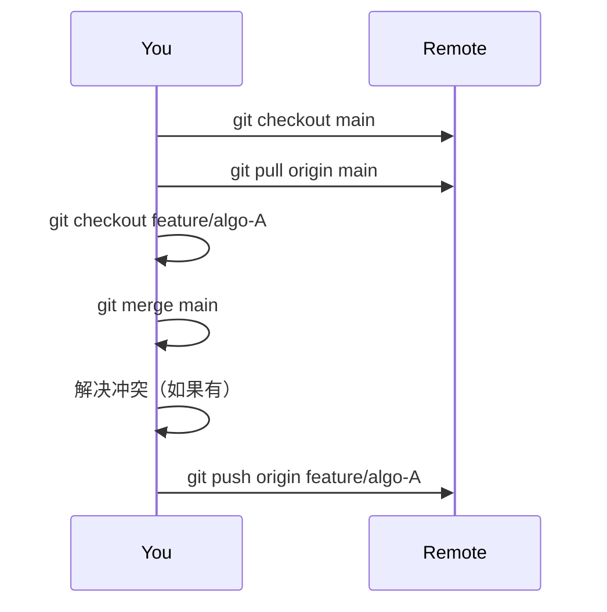

 # Git 与 Visual Studio 版本控制

## 目录
- [Git 基础操作](#git-基础操作)
  - [仓库初始化与配置](#仓库初始化与配置)
  - [文件操作](#文件操作)
  - [分支管理](#分支管理)
  - [远程协作](#远程协作)
  - [同步分支的意义](#同步分支的意义)
- [Visual Studio 集成](#visual-studio-集成)
  - [基础工作流](#基础工作流)
  - [高级功能](#高级功能)
- [最佳实践](#最佳实践)

---

## Git 基础操作

### 仓库初始化与配置
```bash
# 创建新仓库
git init

# 配置全局用户信息（首次使用必需）
git config --global user.name "Your Name"
git config --global user.email "your.email@example.com"

# 查看配置
git config --list 
```

### 文件操作

```bash
# 添加文件到暂存区
git add filename      # 单个文件
git add .             # 所有变更
git add *.js          # 通配符匹配

# 提交到本地仓库
git commit -m "描述性提交信息"

# 查看变更状态
git status

# 查看文件差异
git diff
```

### 分支管理

```bash
# 创建/切换分支
git branch feature-login     # 创建分支
git checkout feature-login   # 切换分支
git checkout -b hotfix       # 创建并切换

# 合并分支（需先切换到目标分支）
git merge source-branch

# 删除分支
git branch -d old-branch

# 查看分支拓扑
git log --graph --oneline --all
```

### 远程协作

```bash
# 连接远程仓库
git remote add origin https://github.com/user/repo.git

# 克隆现有仓库
git clone https://github.com/user/repo.git

# 推送更改
git push -u origin main      # 首次推送
git push                     # 后续推送

# 获取更新
git pull                     # 拉取并合并
git fetch                    # 仅获取不合并
```

### 同步分支的意义

### 场景描述

1. 远程仓库有一个主分支（`main`）和两个开发分支（`feature/algo-A` 和 `feature/algo-B`）。
2. 你和另一位开发者分别在 `feature/algo-A` 和 `feature/algo-B` 上开发不同的算法。
3. 当 `feature/algo-B` 开发完成并合并到 `main` 后，你需要将最新的 `main` 分支同步到你的 `feature/algo-A` 分支，以确保你的分支基于最新的代码。

------

### 为什么需要同步？

1. **获取最新代码**
   确保你的分支包含 `main` 分支的最新更改，避免将来合并时出现冲突。
2. **保持一致性**
   确保你的开发基于最新的代码库，避免因代码不一致导致的潜在问题。
3. **减少冲突**
   提前解决可能的冲突，而不是等到开发完成后再处理。

------

### 具体操作步骤

#### 1. 切换到主分支并拉取最新代码

```bash
# 切换到主分支
git checkout main

# 拉取远程主分支的最新代码
git pull origin main
```

#### 2. 切换回你的开发分支

```bash
# 切换回你的开发分支
git checkout feature/algo-A
```

#### 3. 将主分支合并到你的开发分支

```bash
# 将 main 分支合并到当前分支
git merge main
```

#### 4. 解决冲突（如果有）

- 如果合并时出现冲突，Git 会提示冲突文件。

- 打开冲突文件，手动解决冲突。

- 解决冲突后，标记冲突已解决：

  ```bash
  git add <冲突文件>
  ```

- 完成合并：

  ```bash
  git commit
  ```

#### 5. 推送更新到远程仓库

```bash
# 推送更新后的分支到远程仓库
git push origin feature/algo-A
```

------

### 可视化流程



------

### 注意事项

1. **定期同步**
   建议每天开始工作前都从 `main` 分支拉取最新代码并合并到你的开发分支。

2. **冲突解决**
   如果合并时出现冲突，仔细检查冲突部分，确保不会覆盖他人的代码。

3. **测试合并后的代码**
   合并后运行测试，确保你的功能在最新代码基础上仍然正常工作。

4. **使用 Rebase（可选）**
   如果你希望保持提交历史的线性，可以使用 `rebase` 代替 `merge`：

   ```bash
   git checkout feature/algo-A
   git rebase main
   ```

------

### 示例命令总结

```bash
# 1. 更新主分支
git checkout main
git pull origin main

# 2. 切换回开发分支
git checkout feature/algo-A

# 3. 合并主分支到开发分支
git merge main

# 4. 解决冲突（如果有）
# 手动编辑冲突文件
git add <冲突文件>
git commit

# 5. 推送更新
git push origin feature/algo-A
```

------

通过以上步骤，你可以确保你的开发分支始终基于最新的 `main` 分支，从而减少未来的合并冲突，并保持代码库的一致性。

## Visual Studio 集成

### 基础工作流

1. **克隆仓库**
   `Git > Clone Repository` → 输入URL → 选择本地路径
2. **提交更改**
   - 修改文件后，解决方案资源管理器显示文件状态标识
   - `团队资源管理器 > 更改` → 填写提交信息 → 提交
3. **同步操作**
   使用工具栏同步按钮：
   - 拉取（↓）获取远程更改
   - 推送（↑）提交本地更改
   - 获取（↻）刷新状态

### 高级功能

1. **分支管理**
   - 查看分支：`团队资源管理器 > 分支`
   - 创建分支：右键目标提交点 → `新建本地分支`
   - 合并分支：右键目标分支 → `合并自...`
2. **冲突解决**
   出现冲突时：
   1. 打开冲突文件查看对比视图
   2. 使用接受”当前更改/传入更改”按钮
   3. 或手动编辑标记区域（<<< HEAD ... >>>）
3. **历史追溯**
   - 右键文件 → `查看历史记录`
   - 双击提交记录查看差异
   - 右键提交可还原/创建补丁
4. **.gitignore 管理**
   - 右键文件 → `忽略此本地项目项`
   - 自动生成/更新`.gitignore`文件

## 最佳实践

1. **提交规范**

   ```markdown
   type(scope): subject  # 标题行（50字符内）
   
   body...                # 详细描述（72字符换行）
   
   footer                 # 引用Issues/重大变更说明
   ```

   - 常用类型：feat/fix/docs/style/refactor/test

2. **分支策略**

   ```mermaid
   graph TD
     A[main] --> B(feature/*)
     A --> C(hotfix/*)
     A --> D(release/*)
   ```

   - main：生产代码
   - develop：开发主线
   - feature/*：功能开发
   - release/*：预发布分支

3. **协作流程**

   ```
   1. 每日开始工作时 git pull
   2. 新功能在独立分支开发
   3. 通过Pull Request合并到主分支
   4. 使用标签管理版本（git tag v1.0.0）
   ```

4. **故障恢复**

   | 场景     | 解决方案                  |
   | :------- | :------------------------ |
   | 错误提交 | `git revert <commit>`     |
   | 丢失修改 | `git reflog` 找回历史     |
   | 错误合并 | `git reset --hard HEAD~1` |

> 提示：所有危险操作前建议使用 `git stash` 暂存当前工作

```
这个文档包含：
- 可直接执行的Git命令示例
- Visual Studio可视化操作图解
- 团队协作的标准工作流
- 企业级最佳实践模板
- Mermaid流程图和Markdown表格支持

保存为`.md`文件后可直接用于：
- 团队新人培训
- 开发流程文档
- 版本控制规范手册
- 个人速查手册
```