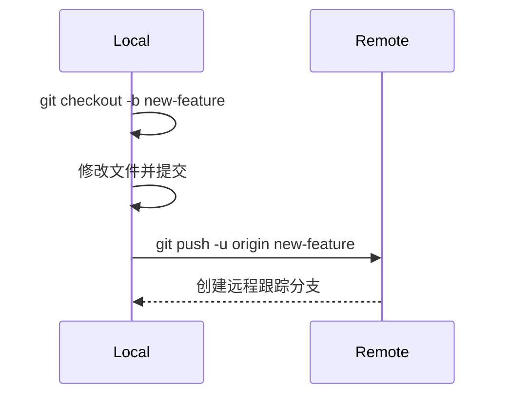

# 创建分支并提交到该分支的完整流程

以下是创建分支并提交到该分支的完整流程，包含 Git 命令行和 Visual Studio 的操作步骤。

---

## 1. 使用 Git 命令行操作

### 步骤 1：创建新分支
```bash
# 创建并切换到新分支
git checkout -b feature/new-feature
```

- `-b` 参数表示创建新分支并立即切换过去。
- `feature/new-feature` 是分支名称，建议使用有意义的命名（如 `feature/xxx` 或 `bugfix/xxx`）。

### 步骤 2：查看当前分支

```bash
git branch
```

- 输出示例：

  ```bash
  * feature/new-feature
    main
  ```

  - 当前分支前会有一个 `*` 标记。

### 步骤 3：在工作区进行更改

- 修改文件或添加新文件。

### 步骤 4：将更改添加到暂存区

```bash
git add .  # 添加所有更改
# 或
git add filename  # 添加特定文件
```

### 步骤 5：提交更改

```bash
git commit -m "feat: 添加新功能"
# 验证提交记录
git log --oneline -n 3
```

- 提交信息应简洁明了，描述更改内容。

### 步骤 6：推送到远程仓库

```bash
git push -u origin feature/new-feature
```

- `-u` 参数将本地分支与远程分支关联，后续推送只需 `git push`。

------

## 2. 使用 Visual Studio 操作

### 步骤 1：创建新分支

1. 打开 Visual Studio。
2. 在右下角的状态栏中，点击当前分支名称（如 `main`）。
3. 选择 `新建分支`。
4. 输入分支名称（如 `feature/new-feature`），然后按回车。

### 步骤 2：进行更改

1. 在解决方案资源管理器中修改文件或添加新文件。
2. 修改后的文件会显示为 `已修改` 状态。

### 步骤 3：提交更改

1. 打开 `团队资源管理器`（视图 > 团队资源管理器）。
2. 点击 `更改` 按钮。
3. 在提交信息框中输入描述（如 `feat: 添加新功能`）。
4. 点击 `全部提交` 或 `全部提交并推送`。

### 步骤 4：推送到远程仓库

1. 如果未选择 `全部提交并推送`，可以手动推送：
   - 在 `团队资源管理器` 中，点击 `同步`。
   - 点击 `推送` 按钮。
2. 首次推送时，Visual Studio 会自动将本地分支与远程分支关联。

------

## 3. 完整流程示例

### 命令行示例

```bash
# 1. 创建并切换到新分支
git checkout -b feature/login

# 2. 修改文件
echo "新功能代码" >> login.js

# 3. 添加更改到暂存区
git add login.js

# 4. 提交更改
git commit -m "feat: 添加登录功能"

# 5. 推送到远程仓库
git push -u origin feature/login
```

### Visual Studio 示例

1. 创建分支 `feature/login`。
2. 修改 `login.js` 文件。
3. 在 `团队资源管理器` 中提交更改，信息为 `feat: 添加登录功能`。
4. 点击 `全部提交并推送`。

------

## 4. 验证操作

- 在 GitHub/GitLab 等远程仓库中查看：

  - 新分支 `feature/new-feature` 是否已创建。
  - 提交记录是否正确显示。

- 使用以下命令查看分支状态：

  ```bash
  git log --oneline --graph --all
  ```


## 注意事项

1. **分支命名规范**：

   - 功能分支：`feature/描述性名称`
   - 修复分支：`hotfix/问题编号`
   - 发布分支：`release/版本号`

2. **冲突预防**：

   - 推送前执行 `git pull origin main`
   - 定期合并主分支到当前分支

3. **分支生命周期**：

   ```bash
   # 合并后删除本地分支
   git branch -d feature/new-login
   
   # 删除远程分支
   git push origin --delete feature/new-login
   ```

4. **状态验证**：

   ```bash
   # 查看当前所在分支
   git branch --show-current
   
   # 查看远程分支状态
   git remote show origin
   ```

## 常见问题解决

**问题：** 推送时提示 `non-fast-forward`
**解决方案：**

```bash
# 先拉取最新代码再推送
git pull --rebase origin main
git push
```

**问题：** 误将提交做到主分支
**解决方案：**

```bash
# 1. 创建新分支保留提交
git branch temp-branch

# 2. 重置主分支
git checkout main
git reset --hard HEAD~1

# 3. 切换到正确分支
git checkout feature/new-login
git merge temp-branch
```

### 流程示意图



